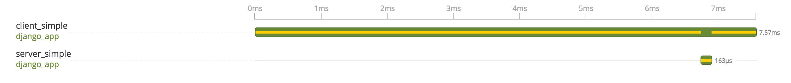
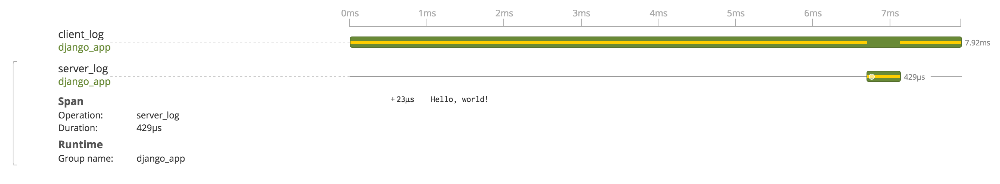
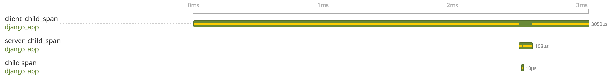

 

Navigate to `/client/simple` to send a request to the server. There will be a span created for both the client request and the server response from the tracing decorators, `@tracer.trace()`.

### Log a Span

Navigate to `/client/log` to send a request to the server and log something to the server span. There will be a span created for both the client request and server response from the tracing decorators. The server views.py handler will manually log the server span with the message 'Hello, world!'.

### Create a Child Span manually

Navigate to `/client/childspan` to send a request to the server and create a child span for the server. There will be span created for both the client request and server response from the tracing decorators. The server views.py handler will manually create and finish a child span for the server span. 

### Don't Trace a Request

Navigating to `/client` will not produce any traces because there is no `@trace.trace()` decorator. However, if `settings.OPENTRACING['TRACE_ALL_REQUESTS'] == True`, then every request (including this one) will be traced, regardless of whether or not it has a tracing decorator.
